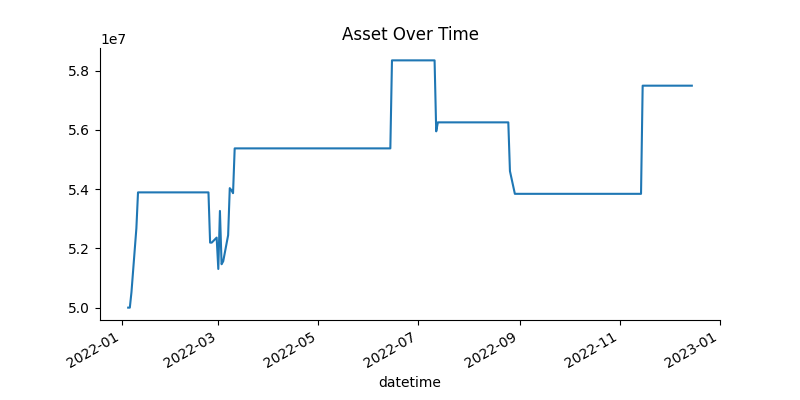
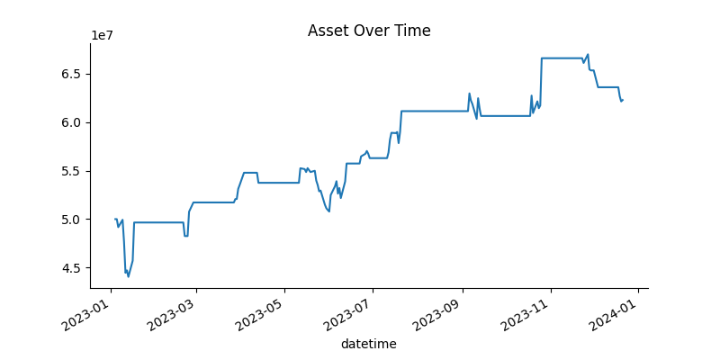

# Abstract
The project aims to combine the Moving Average Convergence Divergence (MACD) and Exponential Moving Averages (EMA) to identify trends and generate profitable trades in the derivatives market. By utilizing EMAs for trend confirmation and MACD for momentum signals, traders can enhance entry and exit precision. Backtesting on historical data demonstrates that this strategy improves trend-capturing accuracy while minimizing false signals. 

# Introduction
Trend-following strategies in derivatives trading often struggle with false signals during sideways markets. This project addresses this challenge by developing a disciplined approach that combines MACD momentum signals with EMA trend confirmation, applied to the VN30 Index Futures.
The goal is to create a systematic, rules-based strategy that improves trade accuracy and risk-adjusted returns. Through rigorous backtesting and parameter optimization across in-sample (2024) and out-sample (2021–2022-2023) data, the method aims to validate its robustness in capturing trends while minimizing drawdowns.

# Background

## EMA (Exponential Moving Average)
The Exponential Moving Average (EMA) is a weighted moving average that gives more weight to recent prices. It is calculated as:

**EMA<sub>t</sub> = EMA<sub>t-1</sub> + α × (P<sub>t</sub> − EMA<sub>t-1</sub>)**

Where:
- **EMA<sub>t</sub>** is the EMA at time *t*,
- **EMA<sub>t-1</sub>** is the previous EMA value,
- **P<sub>t</sub>** is the current price at time *t*,
- **α** is the smoothing factor, defined as **α = 2 / (N + 1)**,
- **N** is the number of periods.

The EMA reacts more quickly to recent price changes compared to the Simple Moving Average (SMA), making it a popular choice for identifying trends in fast-moving markets.

## MACD (Moving Average Convergence Divergence)
The Moving Average Convergence Divergence (MACD) is a momentum indicator that shows the relationship between two EMAs. It is calculated as:

**MACD = EMA<sub>short</sub> − EMA<sub>long</sub>**

Where:
- **EMA<sub>short</sub>** is the short-term EMA (e.g., 12-period),
- **EMA<sub>long</sub>** is the long-term EMA (e.g., 26-period).

The MACD is often paired with a signal line, which is the EMA of the MACD (e.g., 9-period). The difference between the MACD and the signal line is represented as the MACD histogram. Key signals include:
- **Bullish Signal**: When the MACD crosses above the signal line, indicating upward momentum.
- **Bearish Signal**: When the MACD crosses below the signal line, indicating downward momentum.

The MACD is widely used for identifying trend reversals, momentum shifts, and potential entry/exit points in trading strategies.

# Trading Hypothesis
A crossover between the MACD line and the signal line can indicate shifts in momentum, signaling potential entry or exit points. While this strategy performs well in trending markets, it often generates late entries—causing traders to miss early trend opportunities—or false signals in choppy conditions due to fluctuations around the zero line. To improve timing and reliability, we incorporate two key enhancements:

1. Early trend confirmation using price action breaking above/below a short-term EMA (e.g., 9-period) within a specific threshold alongside the MACD crossover.

2. A long-term EMA (e.g., 50-period) to filter out noise and confirm the broader trend direction.

By combining these conditions, the strategy aims to capture momentum earlier in the trend cycle while still reducing false signals in sideways markets.

## When to Open the Position
**Entry Conditions:**

- **A long position is opened when:**
  - The MACD line crosses above the MACD signal line.
  - The MACD line shows a positive derivative, indicating potential growing bullish momentum.
  - The current closed price is above the 50-period Exponential Moving Average (EMA), confirming an uptrend.

- **A short position is opened when:**
  - The MACD line crosses below the MACD signal line 
  - The MACD line shows a negative derivative, signaling bearish momentum.
  - The price is below the 50-period EMA, confirming a downtrend.

**Position Sizing**

- Before entering a position, the system calculates the margin required for the trade using the leverage ratio.
- A trade is only executed if there are enough funds in the asset balance to cover the required margin.
- If there are insufficient funds, the trade is not executed, preventing over-leveraging.
- Formula: `deposit_required =  price * MARGIN_RATIO * MULTIPLIER / AR_TARGET` with `MARGIN_RATIO = 175`, `MULTIPLIER=100000` and `AR_TARGET=0.8`

**Trading Tactics:**

- Only one trade is open at a time to reduce risk and avoid overexposure.
- Trades are only executed if trend confirmation is present (MACD crossover + EMA direction).
- If a trade is executed, it is tracked continuously until an exit condition is met.
- Each trade is subject to strict entry and exit criteria, ensuring that trades align with strong momentum moves rather than short-term fluctuations.

## When to Close the Position
**Take-Profit and Stop-Loss Conditions:**
- A trade is closed if it reaches a predefined profit or loss threshold.
- The stop-loss default  threshold is set at -15 points, meaning a trade will be exited if the loss exceeds this level.
- The take-profit threshold is 25 points, ensuring profitable trades are closed before market reversals.
- Each trade’s profit or loss is adjusted for transaction fees before being realized.
**Exit signal: MACD histogram**
- Instead of closing the position when the histogram turns opposite to the position type. Given a closed threshold = 0.5
- A long position is closed if the histogram below 0.5.
- A short position is closed if the histogram above -0.5.

**Trading Tactics:**

- Positions are only closed when necessary to avoid unnecessary trading fees and maximize returns.
- Unrealized profit/loss is tracked separately to assess the performance of open trades.
- If a position does not meet the exit criteria, it remains open, and unrealized profit/loss continues to be updated.

# Data
- **Target Market**: VN30 Index Future Contract – VN30F1
- **Data Source**: API from AlgoTrade Database
- **Data Period**: Divided into two types:
  - In-sample data: from 01-01-2024 to 31-12-2024
  - Out-sample data: from 01-01-2021 to 31-12-2023 (Divided into 3 different test files)
- **How to Get the Input Data?**
  - All the data is stored in `database` folder in the root directory of the project.
- **Data Format**: mainly CSV files, JSON files are used to store evaluation results and hyperparameters.

## Data Collecting
- Fetching by using SQL command from API AlgoTrade.
- You can check `utils/download_data.py` to check and modify the SQL command.

## Data Processing
- Extracting the all records after 9.00AM and before 14.45PM.
- After fetching the data into a list, it is converted into a Pandas DataFrame.
- The dataset is then saved as a CSV file for future use.
- The datetime column is set as the index, and the price column is converted to a numeric format. The data is resampled to a daily frequency, computing Open, High, Low, and Close (OHLC) values for each day. Any days without trading activity are removed by dropping rows containing NaN values.
- Finally, the processed OHLC dataset is visualized using a candlestick chart, providing a clear graphical representation of price trends and trading volumes over time.


# Implementation
## Enviroment Setup
- Set up python virtual environment
  ```terminal
  python -m venv venv
  source venv/bin/activate # for Linux/MacOS
  .\venv\Scripts\activate.bat # for Windows command line
  .\venv\Scripts\Activate.ps1 # for Windows PowerShell
- Install the required packages from `requirements.txt`.
  ```terminal
  git clone https://github.com/algotrade-course/Group-10.git
  cd Group-10
  pip install --upgrade -r requirements.txt
## Download Data
You can download the necessary data files from [Google Drive](https://drive.google.com/drive/folders/1QkcBh4xTLQ2pv0PILrjtK7H73RMYT7PI?usp=drive_link) and put them in your project.
## Run the strategy
- The default command-line argument to reproduce my result
  ```terminal
  python main.py
- Otherwise, you can customize any file paths or hyperparameters with this example usage
  ```terminal
  python main.py --initial_asset 60000000 --cut_loss -10 --take_profit 30 --in_sample True --optimize True --plot False --data_file "database/2024.csv" --optimize_file "config/optimized_params.json"
## Data Visualization
- You just turn the plot variable into True and the code will open the chart to help you keep track of price every day.
  ```terminal
  python main.py --plot True

# In-sample Backtesting
- **Data**: Backtest on data of 1 year 2024
- **Initial Parameters** (default parameters of MACD indicator):
  - `short_ema = 12`
  - `long_ema = 26`
  - `signal_ema = 9`
  - `window_sma = 50`
  - `CUT_LOSS_THRES = -15`
  - `TAKE_PROFIT_THRES = 25`
  - `INITIAL_ASSET = 50,000,000 (50 million)`
- **Command**:
  ```terminal
  python main.py
- **Result**:
  - With initial parameters:
    - Total asset after a year: 64,351,000
    - Total transactions: 18
    - Return rate: 28.70%
    - Sharpe ratio: 1.43
    - Max Drawdown: -9.59%
  - 

## Optimization
- Using the Optuna library to update the hyper-parameters:
  ```python
  short_ema = trial.suggest_int('short_ema', 7, 14)
  long_ema = trial.suggest_int('long_ema', 14, 28)
  signal_ema = trial.suggest_int('signal_ema', 7, 14)
  window = trial.suggest_int('window', 40, 60)
  CUT_LOSS_THRES = trial.suggest_int('CUT_LOSS_THRES', -20, -10)
  TAKE_PROFIT_THRES = trial.suggest_int('TAKE_PROFIT_THRES', 15, 30)
  seed_value = 42
- **Command**: 
  ```terminal
  python main.py --optimize=True
- **History**:
  The chart plot the process of optimizing 100 times.


- **After Optimization parameters**:
  - `short_ema = 7`
  - `long_ema = 26`
  - `signal_ema = 9`
  - `window_sma = 51`
  - `CUT_LOSS_THRES = -13`
  - `TAKE_PROFIT_THRES = 28`
- **Result**:
  - With optimized parameters:
   - Total asset after a year: 73,102,000
   - Total transaction: 14
   - Return rate: 46.20%
   - Sharpe ratio: 2.67
   - Max Drawdown: -7.25%


# Out-sample Backtesting
- **Data**: Backtest on data of 3 years from 2021 to 2023
- **Parameters**: Take from the most optimized parameters of in-sample data
  - `short_ema = 7`
  - `long_ema = 26`
  - `signal_ema = 9`
  - `window_sma = 51`
  - `CUT_LOSS_THRES = -13`
  - `TAKE_PROFIT_THRES = 28`
- **Command**:
    ```terminal
  python main.py --data_file database/2021.csv --in_sample False
  python main.py --data_file database/2022.csv --in_sample False
  python main.py --data_file database/2023.csv --in_sample False
- **Result of 2021**:
   - Total asset after a year: 58,227,000
   - Total transaction: 9
   - Return rate: 16.45%
   - Sharpe ratio: 0.94
   - Max Drawdown: -7.62%

- **Result of 2022**:
   - Total asset after a year: 57,497,000
   - Total transaction: 9
   - Return rate: 14.99%
   - Sharpe ratio: 0.91
   - Max Drawdown: -7.73%

- **Result of 2023**:
   - Total asset after a year: 62,808,000
   - Total transaction: 17
   - Return rate: 25.09%
   - Sharpe ratio: 1.09
   - Max Drawdown: -11.90%


# Paper trading
Unfortunately, the dataset provided in the course was not sufficient for our group to fully implement and test the algorithm, as it operates on daily sampled data. This limitation restricted our ability to optimize and evaluate the strategy effectively. We hope that in future iterations of the course, more comprehensive datasets will be made available to support deeper analysis and further enhance project outcomes.

# Conclusion
This project developed a robust MACD-EMA strategy for VN30 Index Futures, demonstrating consistent profitability across both in-sample (2024) and out-of-sample (2021–2023) periods. Key takeaways:

- Optimization Matters – Fine-tuning parameters with Optuna boosted returns by 17.5% (28.7% → 46.2%) and improved risk-adjusted performance (Sharpe: 1.43 → 2.67).

- Trend Filters Work – Combining MACD crossovers with 50-EMA trend confirmation reduced false signals, evidenced by lower drawdowns (-9.59% → -7.25%).

- Real-World Viability – The strategy generated positive returns in all test years, including volatile markets (2021: +16.45%, 2022: +14.99%, 2023: +25.09%), proving adaptability.

Overall, the strategy exhibited strong generalization capabilities, delivering positive returns across diverse market conditions in out-of-sample testing. Future work could explore extending the model to other derivatives markets, incorporating additional risk management techniques, or integrating machine learning for dynamic parameter adjustment.