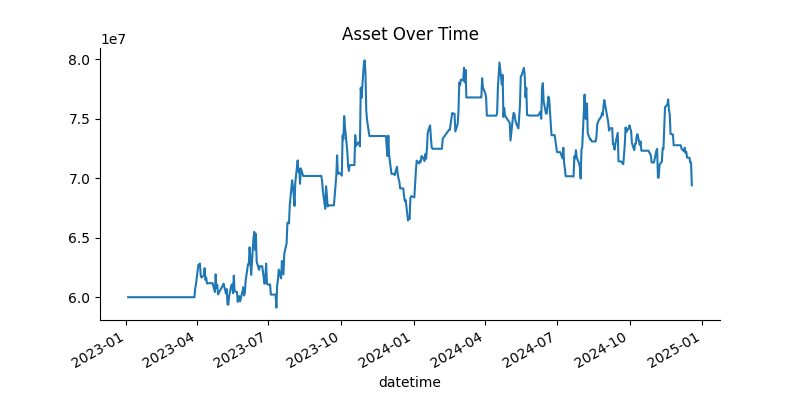
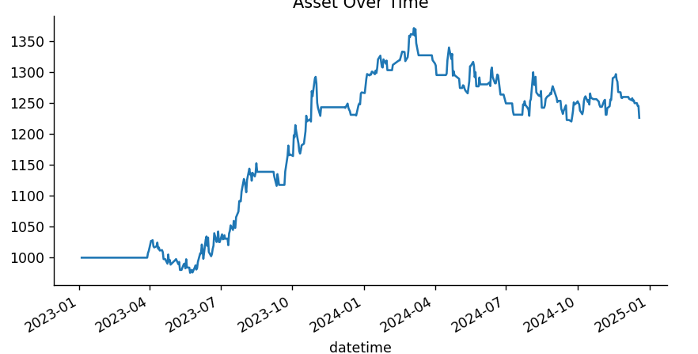
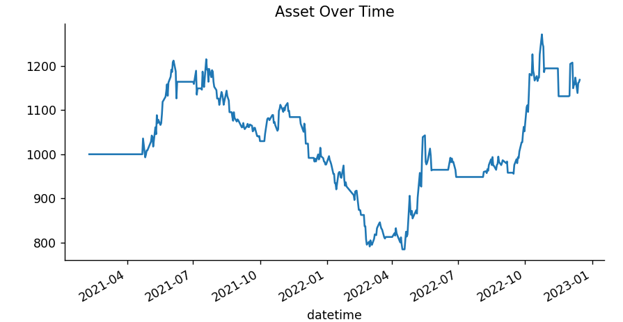

## 1. Trading Hypothesis
A crossover between the MACD line and the signal line can indicate shifts in momentum, signaling potential entry or exit points. This strategy tends to perform best in trending markets and on higher timeframes, where price movements exhibit clearer directional trends. However, in ranging or choppy market conditions, MACD crossovers often generate false signals due to frequent fluctuations around the zero line. To enhance reliability and reduce false trades, an additional trend confirmation indicator, such as a long-term Simple Moving Average (SMA), is incorporated to ensure trades are only executed in alignment with the prevailing market trend. By combining MACD signals with trend confirmation, this strategy aims to capture strong momentum moves while minimizing the impact of market noise.
### When to Open the Position
**Entry Conditions:**

- **A long position is opened when:**
  - The MACD line crosses above the MACD signal line, indicating bullish momentum.
  - The price is above the 50-period Simple Moving Average (SMA), confirming an uptrend.

- **A short position is opened when:**
  - The MACD line crosses below the MACD signal line, signaling bearish momentum.
  - The price is below the 50-period SMA, confirming a downtrend.

**Position Sizing and Risk Management:**

- Before entering a position, the system calculates the margin required for the trade using the leverage ratio.
- A trade is only executed if there are enough funds in the asset balance to cover the required margin.
- If there are insufficient funds, the trade is not executed, preventing over-leveraging.
**Trading Tactics:**

- Only one trade is open at a time to reduce risk and avoid overexposure.
- Trades are only executed if trend confirmation is present (MACD crossover + SMA direction).
- If a trade is executed, it is tracked continuously until an exit condition is met.
- Each trade is subject to strict entry and exit criteria, ensuring that trades align with strong momentum moves rather than short-term fluctuations.

### When to Close the Position
**Take-Profit and Stop-Loss Conditions:**
- A trade is closed if it reaches a predefined profit or loss threshold.
- The stop-loss threshold is set at -8 points, meaning a trade will be exited if the loss exceeds this level.
- The take-profit threshold is 40 points, ensuring profitable trades are closed before market reversals.

**Exit signal: MACD histogram**

- A long position is closed if the histogram turns negative.
- A short position is closed if the histogram turns positive.

**Position Sizing:**

- Each trade’s profit or loss is adjusted for transaction fees before being realized.
- The margin required for each position is calculated using a margin ratio (0.175) and a leverage factor (AR_TARGET = 0.8), ensuring that trades are sized appropriately based on available capital.
- If an open position meets the exit conditions, its profit or loss is added to the total asset value.

**Trading Tactics:**

- Positions are only closed when necessary to avoid unnecessary trading fees and maximize returns.
- Unrealized profit/loss is tracked separately to assess the performance of open trades.
- If a position does not meet the exit criteria, it remains open, and unrealized profit/loss continues to be updated.

## 2. Data
- **Target Market**: VN30 Index Future Contract – VN30F1
- **Data Source**: API from AlgoTrade Database
- **Data Period**: Divided into two types:
  - In-sample data: from 01-01-2023 to 31-12-2024
  - Out-sample data: from 01-01-2021 to 31-12-2022
- **How to Get the Input Data?**
  - Fetching by using SQL command from API AlgoTrade

## 3. Data Processing
- After fetching the data into a list, it is converted into a Pandas DataFrame.
- The dataset is then saved as a CSV file for future use.
- The datetime column is set as the index, and the price column is converted to a numeric format. The data is resampled to a daily frequency, computing Open, High, Low, and Close (OHLC) values for each day. Any days without trading activity are removed by dropping rows containing NaN values.
- Finally, the processed OHLC dataset is visualized using a candlestick chart, providing a clear graphical representation of price trends and trading volumes over time.

## 4. Implementation
- Download libraries from `requirements.txt`.
- Toggle the parameter of the `connect_db` function in `utils/download_data.py` to download both in-sample and out-sample datasets. I already save both the datasets into csv files for later usage.
- Run the `main` function to see the result of the strategy on out-sample data. If you want to test the in-sample data, just modify `main(True)`.

## 5. In-sample Backtesting
- **Data**: Backtest on data of 2 years from 2023 to 2024
- **Initial Parameters** (default parameters of MACD indicator):
  - `short_ema = 12`
  - `long_ema = 26`
  - `signal_ema = 9`
  - `window_sma = 50`
  - `CUT_LOSS_THRES = -8`
  - `INITIAL_ASSET = 60000000 (60 million)`
- **Result**:
  - With initial parameters:
    - Total asset after 2 years: 69404000.00
    - Total transactions: 172
    - Return rate: 15.67%
    - Sharpe ratio: 0.32
    - Max Drawdown: -16.84%
  - 

## 6. Optimization
- Using the Optuna library to update the hyper-parameters:
  ```python
  short_ema = trial.suggest_int('short_ema', 7, 20)
  long_ema = trial.suggest_int('long_ema', 21, 40)
  signal_ema = trial.suggest_int('signal_ema', 7, 21)
  window = trial.suggest_int('window', 40, 80)
  CUT_LOSS_THRES = trial.suggest_int('CUT_LOSS_THRES', -15, -5)
  seed_value = 0

- **After Optimization parameters**:
  - `short_ema = 16`
  - `long_ema = 28`
  - `signal_ema = 12`
  - `window_sma = 49`
  - `CUT_LOSS_THRES = -7`
- **Result**:
  - With optimized parameters:
   - Total asset after 2 year: 81636000.00
   - Total transaction: 147
   - Return rate: 36.06%
   - Sharpe ratio: 0.76
   - Max Drawdown: -16.69%


## 7. Out-sample Backtesting
- **Data**: Backtest on data of 2 years from 2021 to 2022
- **Parameters**: Take from the most optimized parameters of in-sample data
  - `short_ema = 16`
  - `long_ema = 28`
  - `signal_ema = 12`
  - `window_sma = 49`
  - `CUT_LOSS_THRES = -7`
- **Result**:
   - Total asset after 2 year: 72010000.00
   - Total transaction: 175
   - Return rate: 26.22%
   - Sharpe ratio: 0.44
   - Max Drawdown: -54.13%


